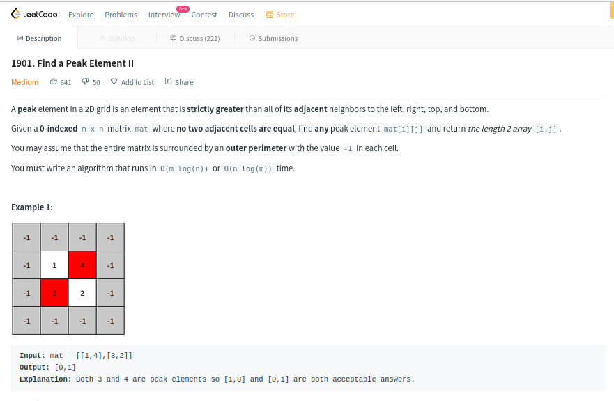
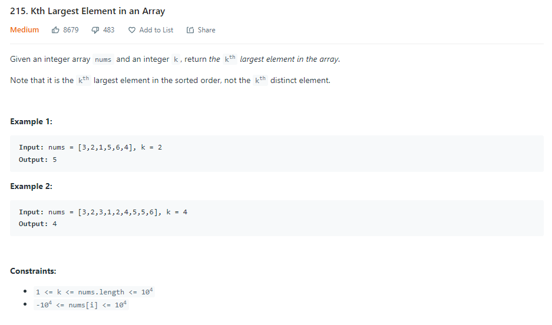
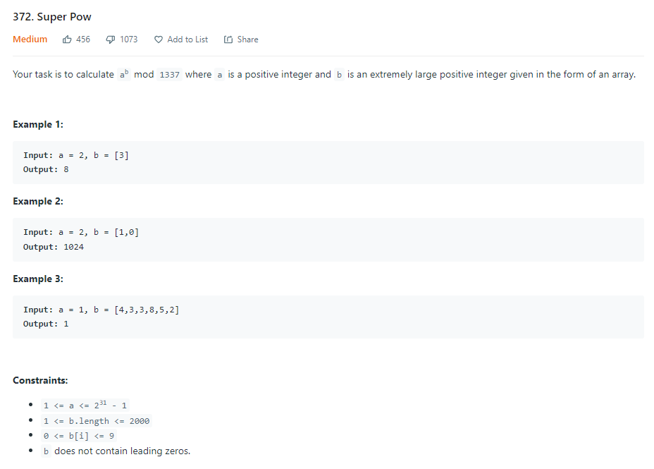
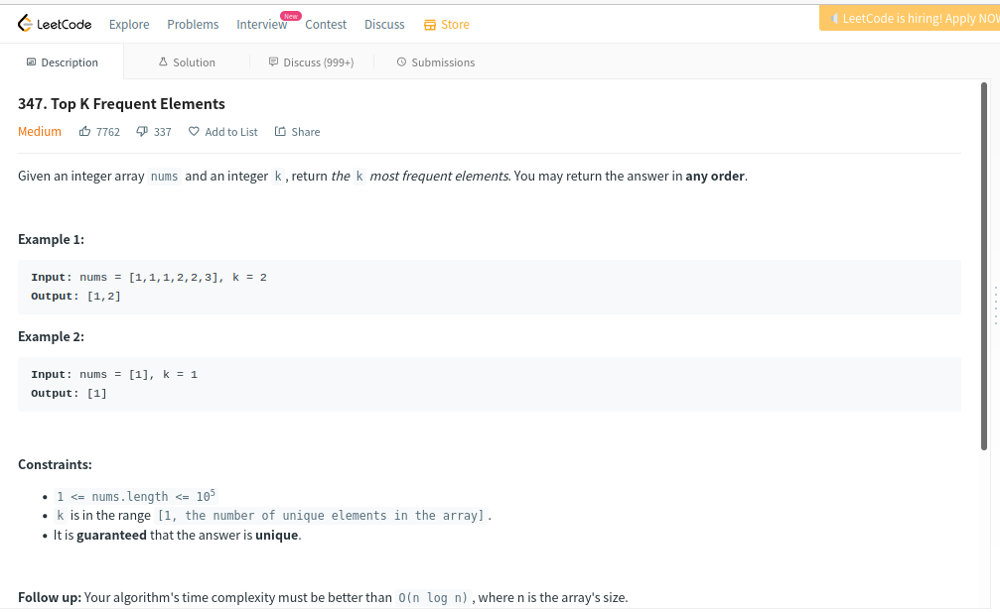

# D-C_Dupla25

**Número da Lista**: 4<br>
**Conteúdo da Disciplina**: Dividir e Conquistar<br>

## Alunos
|Matrícula | Aluno |
| -- | -- |
| 18/0101617  |  Guilherme de Morais Richter |
| 18/0102613  |  Ítalo Fernandes Sales de Serra |

## Apresentação

Faça o download do vídeo na pasta <b>apresentacao</b>.

Ou clique no link para assistir à apresentação no youtube: <i>ainda não disponível</i>

## Sobre 

Este projeto tem o objetivo de solucionar problemas de competição do juiz online <b>LeetCode</b>, utilizando a técnica<b>Dividir e Conquistar</b>.

Os problemas selecionados foram:

<b>1)</b> - Find a Peak Element II - <b>medium</b> - link: https://leetcode.com/problems/find-a-peak-element-ii/

<b>2)</b> - Kth Largest Element in an Array - <b>medium</b> - link: https://leetcode.com/problems/kth-largest-element-in-an-array

<b>3)</b> - Super Pow - <b>medium</b> - link: https://leetcode.com/problems/super-pow/

<b>4)</b> - Top K Frequent Elements - <b>medium</b> - link: https://leetcode.com/problems/top-k-frequent-elements/

## Screenshots

<b>Screenshot do problema Find a Peak Element II.</b>


<b>Accepted do problema Find a Peak Element II.</b>
Find_a_Peak_Element_II.png)

<b>Screenshot do problema Kth Largest Element in an Array.</b>


<b>Accepted do problema Kth Largest Element in an Array.</b>
Kth_Largest_Element_in_an_Array.png)

<b>Screenshot de Super Pow.</b>


<b>Accepted de Super Pow.</b>
Super_Pow.png)

<b>Screenshot de Top K Frequent Elements.</b>


<b>Accepted de Top K Frequent Elements.</b>
Top_K_Frequent_Elements.png)

## Instalação 

**Linguagem**: Python<br>
**Framework**: Não possui<br>

Para se ter os arquivos na sua máquina, é necessário seguir o seguinte passo:

- Clonar o nosso repositório do GitHub para a sua máquina, digitando no terminal (necessário ter o Git instalado):

```python
git clone https://github.com/projeto-de-algoritmos/D-C_Dupla25.git
```

Não é necessário instalar linguagem ou framework, pois os algoritmos podem ser executados em seu próprio juiz online de origem.

## Uso 

Como este projeto se trata de exercícios de um juiz online, ao entrar na página de cada problema, como por exemplo, a do Super Pow (link: https://leetcode.com/problems/super-pow/), temos a seguinte interface:

<b>Exemplo de submissão.</b>
Super_Pow.png)

No exemplo acima, basta copiar o código-fonte do arquivo Super_Pow.py, selecionar a linguagem que ele está escrito, no caso Python, e em seguida clicar no botão Submit, no canto inferior direito.

Seguindo esse passo para os outros dois problemas, é possível verificar o funcionamento de todo o projeto.

## Outros 

Não há outras observações.